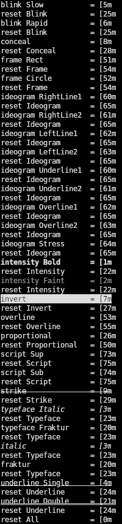

# Ansi SGR

A Haskell module for ANSI SGR codes: background/foreground/underline color, intensity, blink, underline, overline, subscript/superscript, etc

*Have you ever laid awake at night wishing you could color underlines in terminal outputs?*<br />
*Have you ever been depressed at not having an easy way to use uncommon ANSI codes like blink, superscript and proportional spacing?*<br />
*Have you ever felt like murdering your code editor for not being able to show color previews of ANSI codes that use RGB colors?*<br />
*Look no further! This module is for you!*

## Table

- [Features](#features)
- [Usage](#usage)
- [Status](#status)
- [Preview](#preview)
- [Testing](#testing)
- [AI](#ai)
- [License](#license)

## Features

- Soon comprehensive support of **ALL** the SGR codes, even those supported by **ZERO** terminals! 🥳 *(Only the codes 10-19, for alternative fonts, also supported by absolutely nothing, are not yet implemented, but have no fear, they are coming!)*
- 🎨 Colors for foreground, background and underline
- 🎨 Color using either:
	- 8 basic terminal color palette + bright/dull variants (`Color8`)
	- 256 color palette (`Color256`)
	- 24-bit RGB color palette (`ColorRGB`)
	- Hex wrapper to use hex RGB values, with leading `#` supported so code editors can parse them as colors and display a preview of the actual colors in the code 😎 (`ColorHex`)
	- ... or use all four variants because there is no one to stop you!
- 💄 Styles: blink, strike, underline, overline, italic, fraktur, subscript, superscript, frame, proportional spacing, invert, conceal, ideogram lines, ideogram stress
- Functions insert ANSI codes. They do not wrap your code. If you prefer wrapping functions, try [text-ansi](https://hackage.haskell.org/package/text-ansi), though it doesn't support underline color. Or create an issue in the repo and I'll see about adding wrappers.
- Explicit reset for each attribute (`Reset`)
- Support only `String` for now. `Text` support is planned.
- Split into several modules by category (`Blink`, `Color8`, etc). Import the whole thing via `AnsiSGR`, or import the sub-modules you need: each one is self-contained.
- Contains a Haskell script you can run to see which codes your terminal supports (see [Preview](#Preview))

## Usage

### Importing

Either import the whole String bundle:

`import AnsiSGR.String`

Or import only the modules you need among the following:

```
import AnsiSGR.String.Color8
import AnsiSGR.String.Color256
import AnsiSGR.String.ColorRGB
import AnsiSGR.String.ColorHex

import AnsiSGR.String.Intensity
import AnsiSGR.String.Typeface
import AnsiSGR.String.Underline
import AnsiSGR.String.Blink
import AnsiSGR.String.Invert
import AnsiSGR.String.Conceal
import AnsiSGR.String.Strike
import AnsiSGR.String.Proportional
import AnsiSGR.String.Frame
import AnsiSGR.String.Overline
import AnsiSGR.String.Ideogram
import AnsiSGR.String.Script

import AnsiSGR.String.Reset
```

They are all self-contained.

If you hand-pick modules, you **WILL** need the `Reset` module, which contains all the reset codes (see [Implementation Notes](NOTES.md) for why they're not bundled together with the functions they reset).

### General Usage

All the functions insert the relevant ANSI SGR code. You use them with concatenation:

```haskell
    putStrLn (intensity Bold ++ "Text in bold intensity" ++ reset Intensity)
    putStrLn (fgd Cyan ++ "Text in Cyan" ++ reset Fg)
```

You can use either specific reset functions or the global reset:

```haskell
    putStrLn (intensity Bold ++ fgd Red ++ "ERROR" ++ reset Intensity ++ reset Fg)
    putStrLn (intensity Bold ++ fgd Red ++ "ERROR" ++ reset All)
```

To check how the codes render on your terminal, see [Preview](#Preview)

### Using style functions

...

### Using color functions

...

#### Hex wrapper:

...

## Status

...

## Preview

Not all terminals support all ANSI SGR codes. Actually none that I am aware of support all of them (please tell me if you find one who does).

To see how all the non-color codes render on your terminal, run `make print-styles` or use the [script](examples/PrintAllStyles.hs) directly.

You will get something like :



From that output we can see that [Kitty](https://github.com/kovidgoyal/kitty) renders: blink Slow, intensity Bold, intensity Faint, invert, strike, italic, underline Single, underline Double

## Testing

...

## AI

- No AI code in the module itself
- AI was used to generate the following files:
	- Tests:
		- `TestAllStyles.hs`
	- GitHub actions:
		- `.github/workflows/run-tests.yaml`
- No AI code anywhere else

## License

BSD 3-Clause. See [LICENSE](LICENSE).

